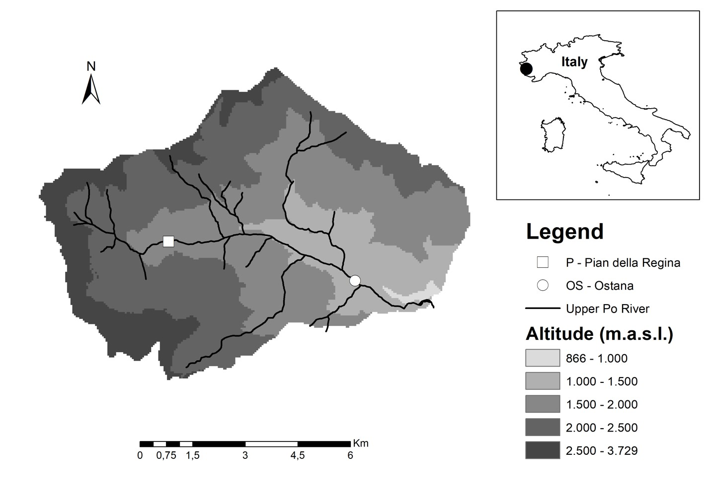

  
  ```{r setup, include=FALSE}
knitr::opts_chunk$set(fig.width=14, fig.height=10)
knitr::opts_chunk$set(fig.align="center")
```

#Getting Started 
These example materials were developed for the Bridging Ecology and Applications Through High Throughput Sequencing Technology Workshop (14 March 2019) using data from a ongoing project investigating the microbial communities associated with stream macroinvertebrates in the Po River. For contact information and questions see our [lab webpage](https://ericbenbow.wixsite.com/website) or [Github site](https://benbowlab.github.io/). 

##Install Packages
The first step is to install and load the packages you will need. The package [phyloseq](https://joey711.github.io/phyloseq/) is a widely used package for analyzing microbial data and has a number of excellent tutorials if you would like more information. The other packages contain more general functions such as statistical testing and plotting that we will use as well. 


```{r,eval=F}
install.packages(c("vegan","ggplot2","RCurl","plyr","dplyr"))

source('http://bioconductor.org/biocLite.R')
biocLite('phyloseq')
```

```{r,include=F}
library(vegan)
library(ggplot2)
library(phyloseq)
library(RCurl)
library(plyr)
library(dplyr)
```

##Loading packages

After the packages are installed, they will have to be loaded each time you start a new R session. You will most likely see several messages when you run the code below but as long as there are not any errors you can move on to the next steps.
```{r ,eval=F}

library(vegan)
library(ggplot2)
library(phyloseq)
library(RCurl)
library(plyr)
library(dplyr)
```


#Data Import
To download and import the data into R, the lines below will download the sample information.

```{r,eval=F}
x<-getURL("https://raw.githubusercontent.com/BenbowLab/BenbowLab.github.io/master/ItalyStreamMicrobiomeMetadata.csv")
metadata<-read.csv(text= x,header=T)
head(metadata) # To see the variables in the metadata file

```


The file containing the sequencing information is too large to directly download into R from Github (1,026 KB). You will have to open a browser to download the data. The first line below will take you to the page with the data. You will see a download button, click that.   

After the file is downloaded, run the next line to import the data into R. This command will open a window where you will navigate to the file and click open to select the file and load it into R.
```{r,eval=F}
browseURL("https://github.com/BenbowLab/BenbowLab.github.io/blob/master/ItalyInvert2018WTax.biom")
biom<-import_biom(file.choose(),parseFunction= parse_taxonomy_greengenes) 


```

```{r,include=F}
biom=import_biom("C:\\Users\\Joe Receveur\\Documents\\MSU data\\ItalyInverts\\ItalyInvert2018WTax.biom",parseFunction= parse_taxonomy_greengenes)
metadata=read.csv("C:\\Users\\Joe Receveur\\Documents\\MSU data\\ItalyInverts\\ItalyInvertMetadataWDiversity11.27.18.csv",header = TRUE)
tree=read_tree("C:\\Users\\Joe Receveur\\Documents\\MSU data\\ItalyInverts\\ItalyInvert11.29.18Tree.nwk")
```

The next section of code will combine together the metadata and sequencing data into a single object in R. The rarifying step accounts for differing numbers of sequencing reads per samples by randomly choosing reads up to the chosen value.
```{r}
sampdat=sample_data(metadata)
sample_names(sampdat)=metadata$id
CombinedData=merge_phyloseq(biom,sampdat)
CombinedData=rarefy_even_depth(CombinedData, 3000, replace = TRUE, trimOTUs = TRUE, verbose = TRUE,rngseed = TRUE)
```

##Data overview{.tabset}

Sampling and methodologies:

The data that we will be are the internal microbiome of aquatic insects from different functional feeding groups at two locations with different riparian conditions (Forest vs Alpine Prairie).




The data consist of an Operational Taxonomic Unit (OTU) table, sample data, and taxonomy table. The OTU table contains the number of sequence variants. The taxonomy table includes the taxonomy information for each sequence variant, from Kingdom down to Genus. The sample data contains metadata for the study.
```{r}
CombinedData

```

```{r,include=F}
theme_set(theme_bw(base_size = 18)+theme(panel.grid.major = element_blank(), panel.grid.minor = element_blank()))

```

These are the most abundant taxon by functional feeding group and sampling station.
```{r echo=F}
Trtdata <- ddply(metadata, c("Sampling_station", "FFG","Taxon_name"), summarise,
                 N    = length(id),
                 meanWeight = mean(Mass),
                 sd   = sd(Mass),
                 se   = sd / sqrt(N)
)
TrtdataSorted<-Trtdata[order(-Trtdata$mean),]
TrtdataSorted[1:5,]
```


#Taxonomic Composition 

The next section of code filters out bacterial taxa that occured at a low abundance and makes additional files where the samples are group together at different levels (Phylum, Family, Genus). 

Question for further understanding: What would happen to your relative abundance plots if you do not filter out low abundance taxa?

```{r}
GPr  = transform_sample_counts(CombinedData, function(x) x / sum(x) ) #transform samples based on relative abundance
GPr = filter_taxa(GPr, function(x) mean(x) > 1e-5, TRUE)
PhylumAll=tax_glom(GPr, "Phylum")# Group samples at the phylum level

PhylumLevel = filter_taxa(PhylumAll, function(x) mean(x) > 1e-2, TRUE) #filter out any taxa lower tha 1%
FamilyAll=tax_glom(GPr,"Family")
FamilyLevel = filter_taxa(FamilyAll, function(x) mean(x) > 2e-2, TRUE) #filter out any taxa lower tha 1%
GenusAll=tax_glom(GPr,"Genus")
GenusLevel = filter_taxa(GenusAll, function(x) mean(x) > 2e-2, TRUE) #filter out any taxa lower tha 1%

```


The next section of code summarizes the phylum level relative abundance by a variable, in this case Functional feeding group, which we will use to plot the data.
```{r}
df <- psmelt(PhylumLevel)
df$Abundance=df$Abundance*100
Trtdata <- ddply(df, c("Phylum", "FFG"), summarise,  #To look at other variables change "FFG", to look at other taxanomic levels change Phylum and use the coorosponding file (e.g. FamilyLevel)
                 N    = length(Abundance),
                 mean = mean(Abundance),
                 sd   = sd(Abundance),
                 se   = sd / sqrt(N)
)
head(Trtdata)
```


##Plotting phylum level relative bacterial abundance
The next section of code will take the summarized data from above and plot the relative abundance by FFG at the phylum level. 
```{r}

PhylumLevelPlot=ggplot(Trtdata, aes(x=FFG,y=mean))+geom_bar(aes(fill = Phylum),colour="black", stat="identity")+xlab("FFG")+ylab("Relative Abundance (> 1%)")
PhylumLevelPlot


```

#Comparing Alpha diversity between sample groups

Shannon and Faith's Phylogenetic diversity have already been calculated for each sample and are already in the metadata file.

Faith's diversity takes into account richness, evenness, as well as the phylogenetic difference between samples. Bacterial species which are further apart on a phylogenetic tree are weighted differently than samples which are closer together. 

```{r}

ggplot(metadata,aes(x=FFG,y=shannon,fill=FFG))+ geom_boxplot()

ggplot(metadata,aes(x=FFG,y=faith_pd,fill=FFG))+ geom_boxplot()

```

##Splitting samples by site

Below is an example of how you would subset the data by site. For example, if you were interested in looking at the differences in alpha diversity between the bacterial communities only at the forested site. 

```{r}
OstanaMetadata<-subset(metadata, Sampling_station == "Ostana")#If you wanted to look at a different variable (e.g. shredders from both locations you would change the code to FFG == "Shredders")

ggplot(OstanaMetadata,aes(x=FFG,y=shannon,fill=FFG))+ geom_boxplot()+ylab("Shannon Diversity Ostana")


```

#Beta diversity
In addition to alpha diversity, we are also interested in looking at the differences in beta diversity between sample groups. To visualize differences in beta diversity, the code below uses PCoA plots with ovals repersenting the 95% confidence intervals for the mean of each group. 

While this example uses jaccard distance, there are a number of other distance methods which can be used depending on the situation. 

```{r}
ord=ordinate(CombinedData,"PCoA", "jaccard") #To use a differetn metric change "jaccard" to the desired metric. For example "wunifrac" or "bray"
ordplot=plot_ordination(CombinedData, ord,"samples", color="FFG")+geom_point(size=4)
ordplot+ stat_ellipse(type= "norm",geom = "polygon", alpha = 1/4, aes(fill = FFG))

#If you were only interested in looking within a single location you could use the code Ostana<-subset_samples(physeq,Sampling_site =="Ostana")

```

#Questions for further understanding

- What happens if you choose a different level to filter out low abundance bacteria before plotting? (e.g. PhylumLevel = filter_taxa(PhylumAll, function(x) mean(x) > 1e-4, TRUE))

- How would you change the code above to plot the family level relative abundance rather than the phylum level? 

- Do the two locations show the same pattern in alpha diversity by functional feeding group? (Seperate the two locations and plot them both individually)


- How does using a different distance metric change the beta diversity plots? (e.g  chance "jaccard" to "bray", "gower")

#Other functions
##Random Forest

Random forest is a modeling technique which uses machine learning to identify important predictors for groups of samples. It also tests how well the model it creates is able to classify samples based on the data and the variable chosen. 

```{r}
#install.packages("randomForest")
#install.packages("knitr")
library(knitr)
library(randomForest)


ForestData=GenusAll#Change this one so you dont have to rewrite all variables
predictors=t(otu_table(ForestData))
response <- as.factor(sample_data(ForestData)$FFG)
rf.data <- data.frame(response, predictors)
FeedingGroupForest <- randomForest(response~., data = rf.data, ntree = 1000)
print(FeedingGroupForest)#returns overall Random Forest results
imp <- importance(FeedingGroupForest)#all the steps that are imp or imp. are building a dataframe that contains info about the taxa used by the Random Forest testto classify treatment 
imp <- data.frame(predictors = rownames(imp), imp)
imp.sort <- arrange(imp, desc(MeanDecreaseGini))
imp.sort$predictors <- factor(imp.sort$predictors, levels = imp.sort$predictors)
imp.20 <- imp.sort[1:23, ]#22
ggplot(imp.20, aes(x = predictors, y = MeanDecreaseGini)) +
  geom_bar(stat = "identity", fill = "indianred") +
  coord_flip() +
  ggtitle("Most important genera for classifying  samples\n by Feeding Group")#\n in a string tells it to start a new line
#imp.20$MeanDecreaseGini
otunames <- imp.20$predictors
r <- rownames(tax_table(ForestData)) %in% otunames
otunames
PredictorTable<-kable(tax_table(ForestData)[r, ])#returns a list of the most important predictors for Random Forest Classification
PredictorTable


```
##Statistical testing 

There are a wide variety of statistical test that can be used to compare microbiome data. Below we will show an example of comparing beta diveristy using a PERMANOVA test.

This test will test whether the variablility within groups is significantly different (Are one group of samples more similar to each other than a different group. 

###Variance in beta diversity
```{r}
GPdist=phyloseq::distance(CombinedData, "jaccard")
beta=betadisper(GPdist, sample_data(CombinedData)$FFG)
permutest(beta)
boxplot(beta)
```


###Testing for differences in beta diversity between groups

The following test will compare whether the differences seen in the PCoA plots from above are significant, using a Permutational Analysis of Variance (PERMANOVA) test.

```{r}
GPdist=phyloseq::distance(CombinedData, "jaccard")

adonis(GPdist ~ FFG*Sampling_station, as(sample_data(CombinedData), "data.frame"))
```


